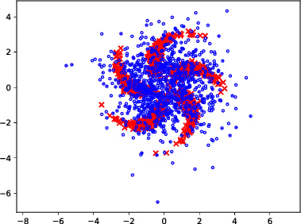
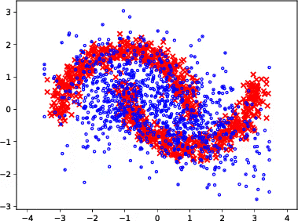

# Code for ADE

The code is organized into two parts. The first part is for synthetic experiments, while the second one is for experiments on Cifar10. See below for more information

## Synthetic Experiments:




### install

First use pip install to install the package, as well as the corresponding dependencies, including sonnet, tensorflow, etc.

```
pip install -e .
```

### Multivariate gaussian

Here is a simple example to use ADE for recovering parameters from a multivariate gaussian distribution. 

```
cd ade/experiments/mvn_unimodal
./run_ade.sh
```

### Toy datasets

We here show a script for moons dataset. You can modify it for other datasets with different parameters. 

```
cd ade/experiments/toy_family
./run_moons.sh
```


## Experiments on Cifar10: 

Please see `ade_cifar` folder for more information.
